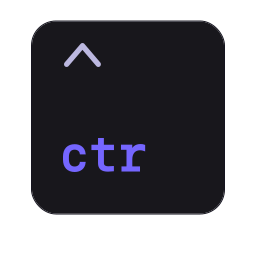

<div id="badges" align="center">
  <!-- Stuff used in this Repository.-->
  <a href="https://rust-lang.org"></a>
  <a href="https://toml.io/"></a>
  <a href="https://zed.dev/"></a>
  <a href="https://warp.dev/"></a>
</div>

<div align="center">
  <h1>
    
    <br />
    ctr
  </h1>
  <h3>
    <code>ctr</code> might work. Probably.
  </h3>
</div>
<div id="links" align="center">
  A cute CLI tool to control your system. <br /> <br />
  <a href="https://github.com/drgndk/ctr/issues/new?labels=bug&template=bug.yml">Report Bug</a> &middot;
  <a href="https://github.com/drgndk/ctr/issues/new?labels=enhancement&template=feature.yml">Request Feature</a>
</div>

<h2 id="building">🔨 Installing</h2>

  ```
  git clone https://github.com/drgndk/ctr.git
  cd ctr

  # requires fish shell.
  # Builds the binary and creates a symlink to /usr/bin/ctr
  ./scripts/build.fish

  # or
  cargo build --release
  ```

<h2 id="contributing">🏗️ Contributing?</h2>

  It's **my** personal project to learn the Language. <br />
  I would love to <a href="discussions/categories/your-thoughts">hear your thoughts</a> on it, but as of now I'm not looking for contributions.

  You can still report bugs or request features using the links above.

<h2 id="license">📜 License</h2>

  This project is licensed under the MIT License. <br /> <br />
  You are free to use, modify, and distribute it under the terms of this license.
